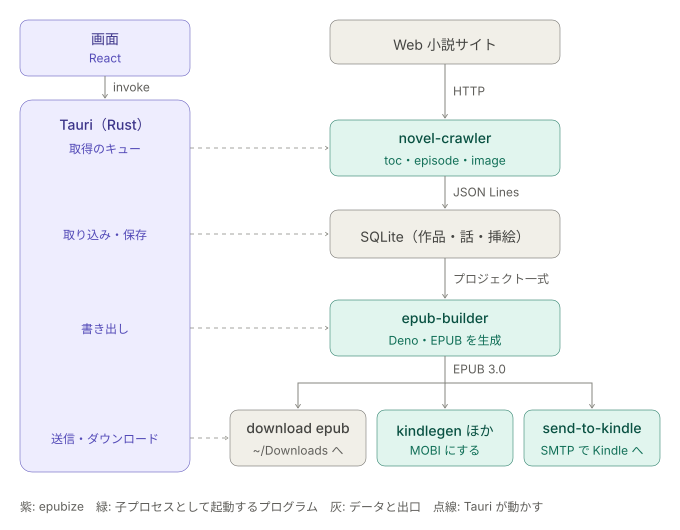

# epubize

Web 小説を EPUB にするツールと、その管理 GUI。

取得(クロール)は別の非公開リポジトリが担い、このリポジトリは取得済みのデータから
EPUB を生成し、作品を管理する部分を受け持つ。GUI は Tauri で動き、データは epubize の SQLite に持つ。

クローラーは子プロセスとして起動し、標準出力の JSON Lines で結果を受け取る。
形式は [schema/crawler-output.v1.schema.json](schema/crawler-output.v1.schema.json) と
[ADR 0005](docs/adr/0005-crawler-data-format.md) にある。クローラーは同梱しない。

設計上の決定とその理由は [docs/adr/](docs/adr/) に、それらをまとめた現在の仕様は [docs/specifications.md](docs/specifications.md) に記録している。

## 仕組み

右の列がデータの流れで、左の Tauri のバックエンド(Rust)が点線で各段を動かす。
取得したデータは SQLite に持ち、EPUB は epub-builder で作る。できた EPUB は、そのまま保存するか、MOBI にするか、Kindle に送る。



| 部品             | 役割                                                                                                       |
| ---------------- | ---------------------------------------------------------------------------------------------------------- |
| 取得のキュー     | ホスト名ごとに 5 秒ずつあけて novel-crawler を起動する。毎日決まった時刻の fetch all もここに積む          |
| 取り込み・保存   | JSON Lines を JSON Schema で確かめて SQLite に保存し、目次から本文と挿絵の取得を積む                      |
| 書き出し         | SQLite から本を読み、`book.toml`、話ごとの Markdown、扉・目次・奥付、スタイルシート、挿絵を一時ディレクトリに書く。download zip はこれをそのまま zip にする |
| 送信・ダウンロード | epub-builder の EPUB を `~/Downloads` に保存する、kindlegen と striptool で MOBI にする、send-to-kindle でメールで送る |

## 使う準備

macOS で、作品の取得から EPUB の書き出し、Kindle への送信までを使うための手順。

### 1. epubize を入れる

Node.js、pnpm、Rust を入れてから、release ビルドを作り、`/Applications` に置く。

```bash
pnpm install
pnpm tauri build --bundles app
cp -R src-tauri/target/release/bundle/macos/epubize.app /Applications/
```

GitHub の Release にある `.dmg` を使ってもよい。署名していないため、初回は開けないと言われる。システム設定の「プライバシーとセキュリティ」で、epubize を開くことを許可する。

release ビルドは `production` の環境で動く。データの置き場所は下の「開発」の節にある。

### 2. 外部のプログラムを入れる

epubize は次のプログラムを子プロセスとして起動する。PATH、`~/bin`、`~/.local/bin`、`/opt/homebrew/bin`、`/usr/local/bin` から自動で探す。
見つからないときや別のものを使うときは、管理画面(settings)で実行ファイルを指定する。

| プログラム       | 使うところ                                       | 入れ方                                                                                                |
| ---------------- | ------------------------------------------------ | ----------------------------------------------------------------------------------------------------- |
| `novel-crawler`  | fetch(作品と話の取得)                            | 非公開のため別に用意する                                                                              |
| `epub-builder`   | download epub、send to Kindle(EPUB 3.0 の生成)   | [tett23/epub-builder](https://github.com/tett23/epub-builder) を clone して `deno task install`。ADR 0019(Kindle の `primary-writing-mode`)に対応したものを使う |
| `send-to-kindle` | send to Kindle(メールでの送信)                   | [tett23/send-to-kindle](https://github.com/tett23/send-to-kindle) の Releases から取り出し、`~/.local/bin` などに置く(下記) |
| `kindlegen`      | download mobi(EPUB から MOBI への変換)           | Kindle Previewer の `Contents/Resources/KFXGen/bin/kindlegen` を `~/bin` などにコピーする               |
| `striptool`      | download mobi(MOBI に埋め込まれた元の EPUB の除去) | 同じ場所の `striptool` を `~/bin` などにコピーする                                                    |

kindlegen と striptool は x86_64 の実行ファイルのため、Apple Silicon では Rosetta が要る([ADR 0032](docs/adr/0032-download-mobi-with-kindlegen-and-striptool.md))。
Send to Kindle のメールは MOBI を受け付けないため、send to Kindle は EPUB を送り、MOBI は端末に USB などで入れる。

send-to-kindle は、Releases に macOS(Apple Silicon と Intel)と Linux 向けの実行ファイルがある。
`curl` か `gh` でダウンロードすると、macOS の検疫の対処が要らない。詳しくは send-to-kindle の README にある。

```bash
tag=v0.2.0
target=aarch64-apple-darwin   # Intel の Mac なら x86_64-apple-darwin
archive="send-to-kindle-$tag-$target.tar.gz"
gh release download "$tag" --repo tett23/send-to-kindle --pattern "$archive" --pattern SHA256SUMS
grep "$archive" SHA256SUMS | shasum -a 256 -c
tar -xzf "$archive"
mv "${archive%.tar.gz}/send-to-kindle" ~/.local/bin/
```

epub-builder は Deno で動く。Finder から起動したアプリはシェルの PATH を引き継がないため、
epubize は子プロセスの PATH に [mise](https://mise.jdx.dev/) の shim(`~/.local/share/mise/shims`)を足す。
Deno は mise で入れておく(`mise use -g deno`)。

### 3. Kindle への送信を設定する

send-to-kindle は SMTP でメールを送る。このリポジトリの [.env.example](.env.example) を、アプリ用データ領域に `.env` として写し、値を書き込む。
`.env.example` も同じ場所に置くと、`.env` に足りないキーを管理画面に出す([ADR 0028](docs/adr/0028-send-to-kindle-env-files.md))。

```bash
dir="$HOME/Library/Application Support/com.github.tett23.epubize/production"
mkdir -p "$dir"
cp .env.example "$dir/.env.example"
cp .env.example "$dir/.env"
chmod 600 "$dir/.env"
```

- `EMAIL`(送信元のメールアドレス)を、Amazon の「コンテンツと端末の管理」の「承認済み E メールアドレス一覧」に加える
- `SEND_TO_KINDLE_EMAIL` には、同じページの端末の欄にある `@kindle.com` のアドレスを書く
- Gmail で送るときは、`SMTP_HOST=smtp.gmail.com`、`SMTP_PORT=587`、`SMTP_USER_NAME` に Gmail のアドレス、
  `SMTP_PASSWORD` に Google アカウントの「アプリ パスワード」を書く

`.env` の場所は、管理画面で変えられる。
epubize は、指定した `.env`、または既定の場所にある `.env` を `--env-file` で渡す。どちらもなければ渡さず、
send-to-kindle は自分の設定ファイル(`~/.config/send-to-kindle/.env`)などから読む。

### 4. 作品を購読する

画面の上の欄に作品の URL を入れて add を押すか、`~/.config/epubize/production/novels.json` に書く(kindlize と同じ形)。
fetch all で、購読している作品の目次と本文を取得する。管理画面で、毎日決まった時刻に fetch all を行うように設定できる。

### 5. 確かめる

管理画面(settings)で、各プログラムの「使用中」にパスが出ていること、`.env` に足りないキーがないことを確かめる。
作品のページの download epub で `~/Downloads` に EPUB ができれば、epub-builder まで動いている。
話を一つ選んで send to Kindle を押し、Kindle に届けば準備は終わり。

## クローラーとのインターフェース

クローラーは同梱せず、次の取り決めに合うものを子プロセスとして起動する。
取り決めは epubize の側が持ち([ADR 0005](docs/adr/0005-crawler-data-format.md))、
レコードの形は JSON Schema の [schema/crawler-output.v1.schema.json](schema/crawler-output.v1.schema.json) にある。

### 起動の仕方

実行ファイルは、管理画面の指定、環境変数 `EPUBIZE_CRAWLER`、PATH などから探した `novel-crawler` の順に決める([ADR 0018](docs/adr/0018-import-and-database-backed-screens.md)、[ADR 0020](docs/adr/0020-settings-screen.md))。
コマンド 1 回が 1 回の取得にあたり、引数で URL を一つ受け取る。

| コマンド              | 標準出力に書くレコード                                     |
| --------------------- | ---------------------------------------------------------- |
| `toc <作品の URL>`    | `novel` を 1 行、続けて目次の順に `toc_entry` を 1 話 1 行 |
| `episode <話の URL>`  | `episode` を 1 行                                          |
| `image <画像の URL>`  | `image` を 1 行(画像のバイト列は base64)                 |

- 標準出力に、1 行 1 レコードの JSON(JSON Lines)を書く。標準入力は使わない
- 成功したら終了コード 0 で終わる。失敗したら `error` レコードを 1 行書き、0 以外の終了コードで終わる
- `error` レコードを書かずに失敗したときは、標準エラー出力の内容を誤りとして画面に出す
- 対応するサイトは `novel` の `site` で示す。いまは `narou`、`novel18`、`hameln`、`kakuyomu` を扱う

### レコード

どのレコードも、版 `v`(いまは `1`)と種類 `type` を持つ。epubize は知らない項目を無視するため、項目を足しても `v` は変わらない。
項目を消したり意味を変えたりするときだけ `v` を上げる。日時は UTC からの時差を含む ISO 8601 で書く。

| `type`      | 主な項目                                                                                                   |
| ----------- | ---------------------------------------------------------------------------------------------------------- |
| `novel`     | `site`、`novelId`、`url`、`title`、`author`(`name`、`url`)、`description`、`episodeCount`、`isConcluded`、`fetchedAt` |
| `toc_entry` | `novelUrl`、`no`(1 始まり)、`url`、`title`、`chapter`、`publishedAt`、`revisedAt`                         |
| `episode`   | `url`、`title`、`body`、`preface`、`afterword`、`images`(`url`、`alt`)、`charCount`、`fetchedAt`          |
| `image`     | `url`、`contentType`、`data`(base64)、`byteLength`、`fetchedAt`                                           |
| `error`     | `url`、`kind`、`message`、`status`(HTTP の状態コード)、`retryAfter`                                       |

- `toc_entry` の `chapter` は章の名前で、章がなければ `null`。続く話で同じ名前なら、同じ章とみなす
- `toc_entry` の `revisedAt` がサイトにあれば入れる。保存した値より新しければ、epubize は本文を取り直す
- `episode` の `images` には、本文、前書き、後書きから参照する画像を、最初に現れた順に全て入れる。epubize は一つずつ `image` で取得する
- epubize は、保存する前に全てのレコードを JSON Schema で確かめる

### 本文の Markdown

`body`、`preface`、`afterword` は CommonMark で、縦書きの本に向けて正規化して渡す([ADR 0005](docs/adr/0005-crawler-data-format.md)、[ADR 0009](docs/adr/0009-normalized-markdown-conventions.md))。
epubize は同じ正規化を重ねず、そのまま EPUB に使う。

- 元の 1 行を 1 つの段落にする。段落の間に 1 つだけある空行は消し、残す空行は `<br>` だけの段落で表す(空行は 2 つまで)
- 括弧で始まらない段落の先頭に全角の空白を 1 つ入れる
- ルビは `<ruby>親文字<rp>(</rp><rt>読み</rt><rp>)</rp></ruby>` で埋め込む。`｜漢字《かんじ》` のような記法は使わない
- 傍点は `<span style="text-emphasis: sesame; -webkit-text-emphasis: sesame;">…</span>`、ほかの強調は `*…*`、太字は `**…**` で表す
- 挿絵は `` で表し、その URL を `images` に入れる
- 本文にリンクは入れない
- `charCount` は、本文をプレーンテキストにしたときの Unicode のコードポイントの数

### 誤りと再試行

クローラーは再試行しない。epubize が `error` の `kind` を見て決める([ADR 0015](docs/adr/0015-fetch-queue.md))。
取得はホスト名ごとのキューで順に行い、1 回ごとに 5 秒あける。

| `kind`                                                                   | epubize の扱い                                                             |
| ------------------------------------------------------------------------ | -------------------------------------------------------------------------- |
| `server_error`、`network`                                                | 同じホストのキューの末尾に積み直す。3 回まで                               |
| `rate_limited`                                                           | `retryAfter` の日時まで(なければ 60 秒)そのホストを止め、先頭で取り直す |
| `unsupported_url`、`not_found`、`forbidden`、`http_error`、`parse_error` | 取り直さない                                                               |

## 開発

clone した後に一度、コミット済み ADR の変更を拒否する git の hook を有効にする(要 Deno)。

```bash
git config core.hooksPath .githooks
```

コミット済みの ADR は、ステータス行以外を変更できない([ADR 0002](docs/adr/0002-immutable-adrs.md))。

GUI は Tauri + React + TypeScript で、パッケージ管理は pnpm を使う([ADR 0006](docs/adr/0006-react-typescript-pnpm-frontend.md))。
Node.js、pnpm、Rust が必要になる。

```bash
pnpm install
pnpm tauri dev
```

検査とテスト([ADR 0022](docs/adr/0022-development-infrastructure.md))。E2E テストは、Tauri のコマンドを偽物に差し替えて Vite の開発サーバーに対して動かす。

```bash
pnpm lint                          # Biome による lint と整形の検査(pnpm format で直す)
pnpm test                          # vitest
pnpm exec playwright install chromium  # 初回だけ
pnpm e2e                           # Playwright
(cd src-tauri && cargo test)
```

配布物は、`v` で始まるタグを push すると GitHub Actions が macOS 向けの `.app` と `.dmg` を作り、下書きの Release に添付する(署名なし)。

データは `development` と `production` の環境ごとに分けて置く([ADR 0014](docs/adr/0014-subscriptions-json-and-environment-directories.md))。
環境は `EPUBIZE_ENV` で指定でき、指定しなければ debug ビルドは `development`、release ビルドは `production` になる。

- 購読している作品: `~/.config/epubize/<環境>/novels.json`(kindlize と同じ形)
- SQLite: `<アプリ用データ領域>/com.github.tett23.epubize/<環境>/epubize.sqlite3`
- ウィンドウの位置と大きさ: `<アプリ用設定領域>/com.github.tett23.epubize/<環境>/window-state.json`

データは SQLite に持ち、起動時に未適用のマイグレーションを自動で適用する([ADR 0013](docs/adr/0013-sqlite-migrations.md))。
マイグレーションは `src-tauri/migrations/` に置き、[mise](https://mise.jdx.dev/) のタスクから操作できる。

```bash
mise run db:new create_novels  # 次の版の空のマイグレーションを作る
mise run db:migrate            # 未適用のマイグレーションを適用する
mise run db:status             # 適用済みの版と未適用のマイグレーションを表示する
mise run db:reset              # データベースを消して全てのマイグレーションを流し直す
```

## ライセンス

[MIT](LICENSE)
